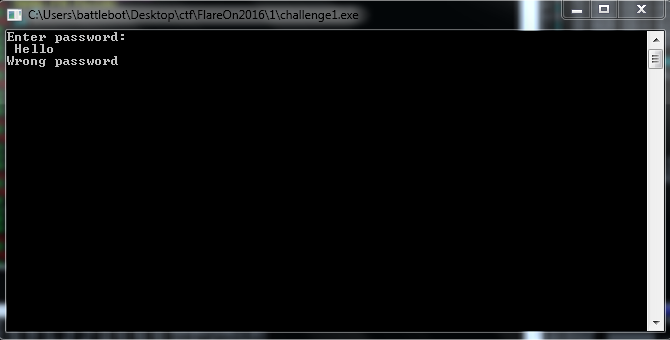
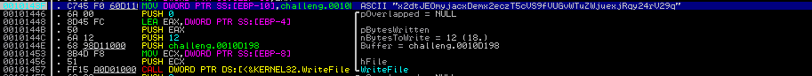
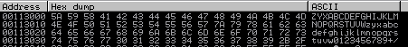
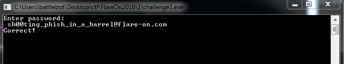

# FLARE On 2016 - Challenge 1

## Write-up
We are given a 32-bit windows PE file. When run it asks for a password.

### Solution
Stepping through the challenge, I noticed a string which seemed to be a base64 encoded string.

Tried to initially decode the string and failed. Then I noticed what seemed to be a custom alphabet used for a custom base64 encoding.

So I grabbed a python script from an online source to test my hypothesis and it worked.

#### Flag
> sh00ting_phish_in_a_barrel@flare-on.com
