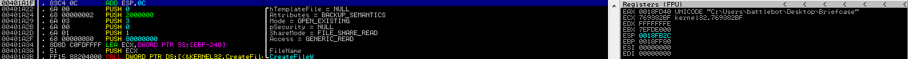
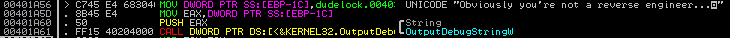
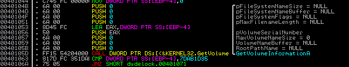
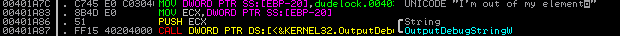
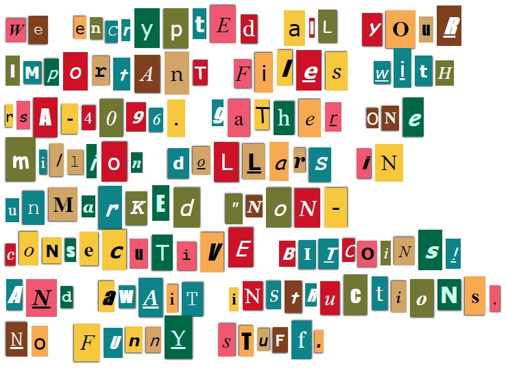
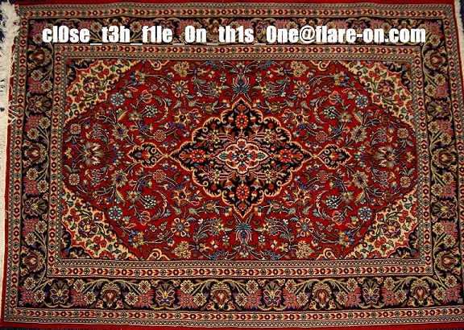

# FLARE On 2016 - Challenge 2 - dudelocker

## Write-up
We are given a 32-bit windows PE file and an encrypted Windows Word document. This challenge emulates a piece of ransomware. When you initially run it, nothing happens.

### Solution
First it looks to see if you have a directory called Briefcase on your desktop.

If you don't have that folder on your Desktop, it will take you to this string. "Obviously you're not a reverse engineer...", and then exit.

It then calls the function GetVolumeInforationA and checks your VolumeSerialNumber against the one it is looking for.

If the serials do not match, end up at the string "I'm out of my element", and then exits.

I change the volume serial number to match what it is looking for to continue.

The program continues to iterate through the Briefcase directory, and doing some crypto on the files present. After it finishes that, it drops the file
ve_vant_ze-money.jpg in that folder and changes your wallpaper to it.

Since the crypto this program is using is AES which is a symmetric-key algorithm, we can use the same key that is generated to encrypt our file, to decrypt them.
My first attempt was to write a C++ program to decrypt the contents of the file BusinessPapers.doc.

I then figured that it would be much easier to just patch the binary's IAT to include the call to the call CryptDecrypt that way I can just change the call
from CryptEncypt to CryptDecrypt thus allowing me to decrypt the file BusinessPapers.doc.

The file must be in the Briefcase folder.

Once I decrypt the file I notice that it is actually a jpg image file. There is our flag.

#### Flag
> cl0se_t3h_f1le_0n_th1s_0ne@flare-on.com
