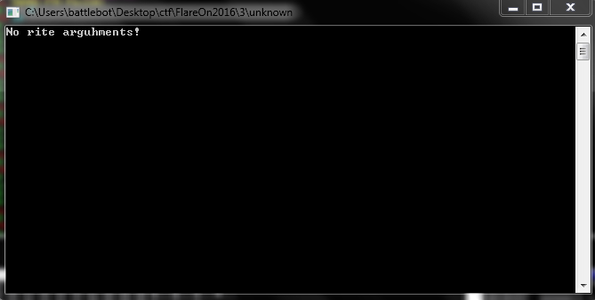
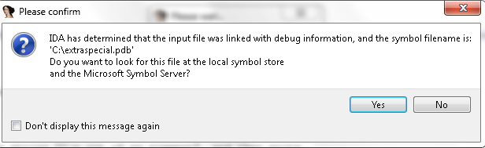
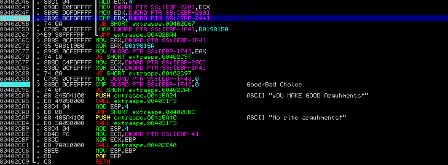
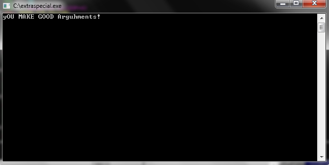

# FLARE On 2016 - Challenge 3 - unknown

## Write-up
We are given a file named unknown, which turns out to be a 32-bit Windows PE executable. When initially run, it out puts "No rite arguhments!"

### Solution
Loading the binary into IDA Pro gives use our first hint. The file was linked with debug information and gives us the original path and file
name. C:\extraspecial.exe

The path and file name need to be changed to this inorder to get the correct flag. Once finding out that the command-line argument is 26 characters long
and guessing that it would be the flag I started probing further. I knew that it was doing some sort of hashing to create a checksum to test your argument,
and by knowing that our flag is 26 characters long and that our flags end in @flare-on.com. I found the location of the check being done in the binary and 
then bruteforcing the rest of the flag.

At location 0x402C55 the program compares the checksum of an individual character with one of the correct flag. Bruteforcing this until all of your values match,
you have the correct flag and receive a good boy message of, "yOU MAKE GOOD Arguhments!"

#### Flag
> Ohs0pec1alpwd@flare-on.com
