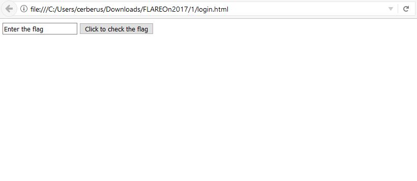
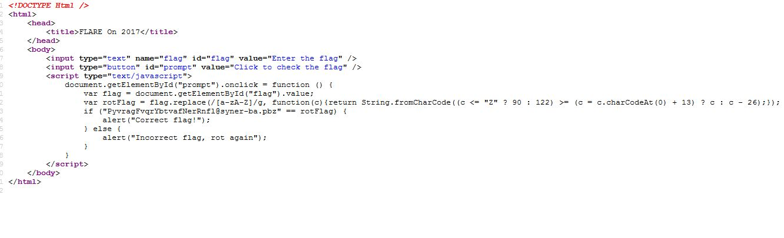

# Flare-On 2017 Challenge #1 - login.html

Welcome to the Fourth Flare-On Challenge! The 
key format, as always, will be a valid email
address in the @flare-on.com domain.

## Write-up
We are given am html file which asks for a flag.

### Solution
First thing to do is look at the source sode of the HTML file.

We can see that this is just a simple rot13 encoding for the flag.
We script a simple solution.

This was more of a sanity check than a true challenge.

#### Flag
> ClientSideLoginsAreEasy@flare-on.com

 

