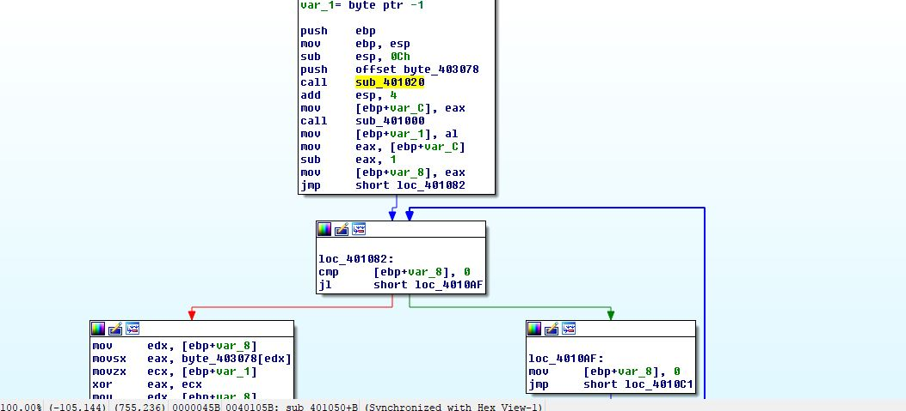

# Flare-On 2007 Challenge #2 - IgniteMe.exe

You solved that last on really quickly! Have
you ever tried to reverse engineer a compiled
x86 binary? Let's see if you are still as quick.

## Write-up
We are given a 32-bit PE file called IgniteMe.exe. When run it
asks for a flag.

### Solution

We open the challenge up in IDA Pro to take a look at it.
It looks pretty straight forward. There are clear paths
to both the good-boy and bad-boy messages.

It's the call at sub_401050 that we are interested in. This is the call
that does all of the flag checking logic.

We see that byte_403078 contains our user input and is xored with some key against some data one byte at a time. That result is stored at byte_403180 and checked against data at byte_403000. The length of this data is 0x27 bytes long.

The only thing we need to do now is figure out the initial key that is being
used for the xor operation.

We can see by the operation that the key ends up being 0x04.

Now we can take the 0x27 bytes at byte_403000 and script our solution.

#### Flag
> R_y0u_H0t_3n0ugH_t0_1gn1t3@flare-on.com
