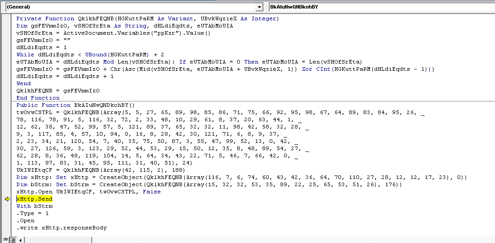
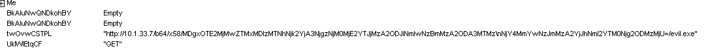

# PAN LabyREnth CTF 2016: Docs Level 1 - BadMacro

## Write-up

We are given a Microsoft Word Document which contains obfuscated VBA macros.

### Solution

Running the macro you can see that it creates a GET request to an IP address. The URL contains clues on how to solve the challenge.

The clues are b64 for base64 which the URL apparently contains and x58 which is 'X' in ASCII. Using this knowledge we can get the flag via decoding the base64 and XORing with x58.

#### Flag
> PAN{ViZib13_0nly2th0s3_Wh0_Kn0w_wh3r32l00k}
