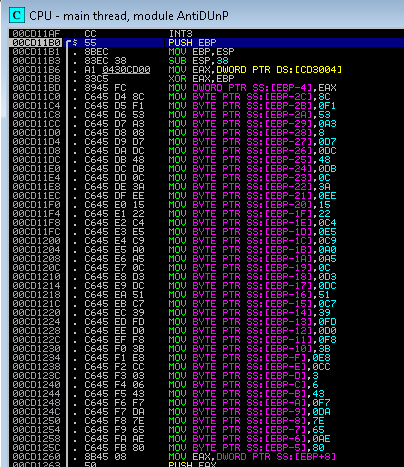

# PAN LabyREnth CTF 2016: Windows Level 1 - AntiD

## Write-up
We're given a 32-bit windows binary named AntiD.exe. When running, it asks for a key. 

Loading it in Stud_PE indicates that it is packed with UPX, although the sections in the binary are named .ups0 and .ups1 rather than .upx*. I try to unpack it using upx to no avail. What I need to do is unpack the binary and then figure out the logic behind the key.

### Solution

I was able to unpack the executable with the built-in UPX unpacker that is included in PE Explorer. Load the binary in Immunity Debugger and set a breakpoint right at where it prompts the user for the key.

The program is expecting a 16 character key to be inputed, but when stepping through I noticed the flag generating algorithm. 

Another thing to note is this little lookup table that is in the binary.

Now we are almost ready to generate our flag.
We know the first four characters or the flag are PAN{ so we take a look at what happens with this. 
The algorithm is:
> var1 = (char xor 0x33) and 0xFF

> var2 = (var1 + 0x44) and 0xFF

> var3 = (var2 xor 0x55) and 0xFF

> var4 = (var3 - 0x66) and 0xFF

Stepping through the algorithm, you find some Anti-Debugging techniques. The program goes into the fail state via calls to IsDebuggerPresent, CheckRemoteDebuggerPresent, and FindWindowW -> if you are using OllyDbg. 

You can patch these calls manualy or use a plugin like hidedebug. 

Enter the character P through the algorithm we get the value 0x8C which is then xored with 0x00 and checked against the table 
noted above. Interesting!!
A character goes through the algorithm, xors it value with the sum of all of the previous' characters generated value anded with 0xFF and checks the table. Well since we know the first 4 characters of the flag, and we have all of the table, and since the inverse of xor is xor, we can reverse the algorithm to get the remaining characters of the flag.  

#### Flag
> PAN{C0nf1agul4ti0ns_0n_4_J08_W3LL_D0N3!}
