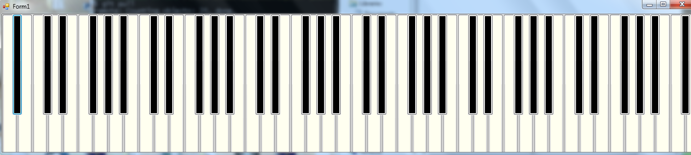
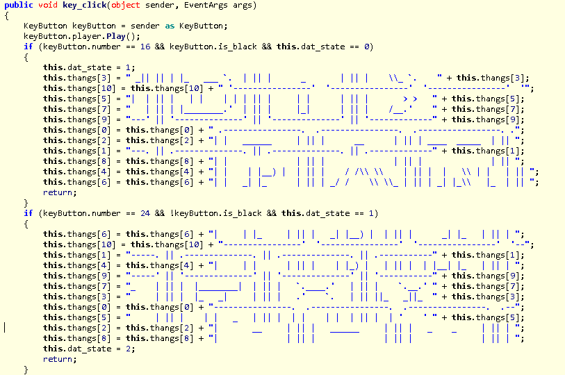
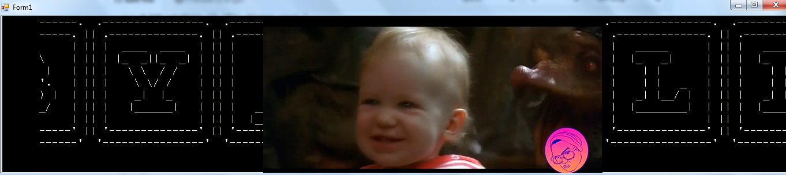

# PAN LabyREnth CTF 2016: Windows Level 2

## Write-up

There are three files for this challenge. babbysay.exe, AxInterop.WMPLib.dll, Interop.WMPLib.dll.
Running the program reveals a keyboard. 
The program was written in .NET so I use ILSpy to take a peek a the program logic. 

### Solution
Some of the interesting code is here. 
The code will do something if a certain sequence of keys are pressed.

> The sequence is b16, w24, w25, w21. The sequence is repeated twice, and the key numbers start from zero.

I get the key and a funny little video. :) 
#### Flag
> PAN{B4BBY_Y3LL5_5O_LOUD!}
