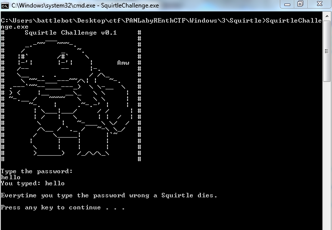
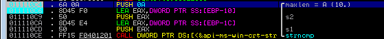
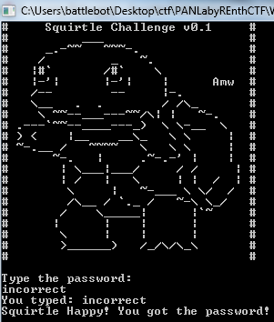
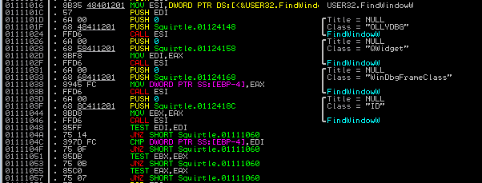
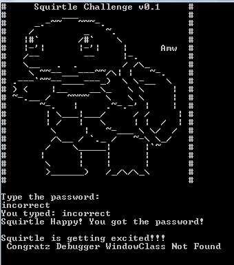
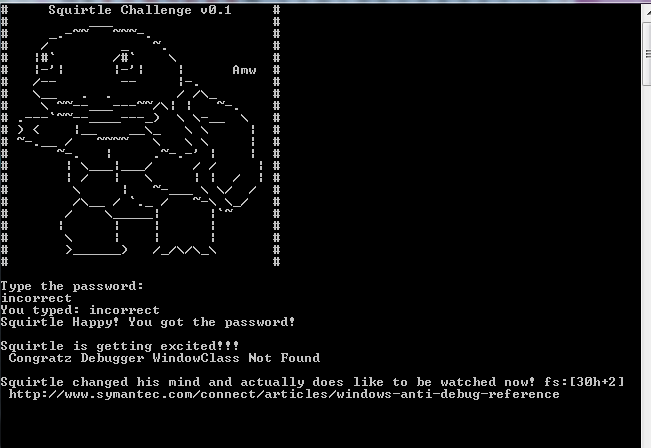
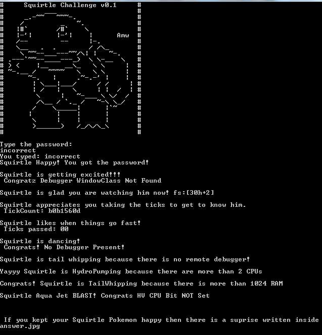

# PAN LabyREnth CTF 2016: Windows Level 3 - Squirtle

## Write-up
We're given a 32-bit windows binary named SquirtleChallenge.exe. When running, it asks for a password. 

Loading the file in IDA Pro and looking at the strings, we get a bunch of hints at some Anti-Debugging techniques.
Here are some of those strings.
>Squirtle is a shy pokemon and doesn't like to be watched. Debugger WindowClass found https://msdn.microsoft.com/en-us/library/windows/desktop/ms633499(v=vs.85).aspx

>Squirtle is getting excited!!! Congratz Debugger WindowClass Not Found

>Squirtle is glad you are watching him now! fs:[30h+2]

>Squirtle changed his mind and actually does like to be watched now! fs:[30h+2] http://www.symantec.com/connect/articles/windows-anti-debug-reference

>Squirtle is TICKEDOFF! His next form has something to say about this. TickCount: %02x http://researchcenter.paloaltonetworks.com/2015/10/ticked-off-upatre-malwares-simple-anti-analysis-trick-to-defeat-sandboxes/ 

>Squirtle appreciates you taking the ticks to get to know him. TickCount: %02x

>You took too long. Squirtle took a nap or you are watching him. Ticks passed: %02x http://anti-reversing.com/Downloads/Anti-Reversing/The_Ultimate_Anti-Reversing_Reference.pdf

>Squirtle likes when things go fast! Ticks passed: %02x

>Don't watch Squirtle squirtle! I bet there is a plugin to help hide. https://msdn.microsoft.com/en-us/library/windows/desktop/ms680345(v=vs.85).aspx

>That's creepy are you watching Squirtle remotely? https://msdn.microsoft.com/en-us/library/windows/desktop/ms679280(v=vs.85).aspx

>Squirtle needs more CPUs for his HydroPump! https://www.trustedsec.com/may-2015/bypassing-virtualization-and-sandbox-technologies/ 

>Squirtle's Aqua Jet doesn't work with fake water. CPU HV Bit Set http://artemonsecurity.com/vmde.pdf

Although these checks can be bypassed manually, I use the hidedebug plugin for Immunity Debugger.

### Solution

At first the program check the user input agains the string "incorrect". This is the password.

Then it checks to see if any GUI's from various debuggers are present.

Then it checks to see if BeingDebugger is set in the PEB, hence the reference to fs:[30h+2]. Must not patch the PEB.

The rest of the checks are passed via the use of the hidedebug plugin. At the end the program will output an image file.

Encoded in binary is our flag.

#### Flag
> PAN{Th3_$quirtL3_$qu@d_W@z_bLuffiNg}
