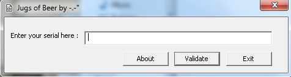
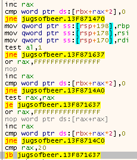
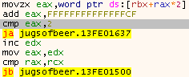
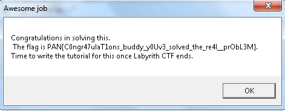

# PAN LabyREnth CTF 2016: Windows Level 4 - JugsOfBeer

## Write-up
This is a 64-bit Windows Gui file. I used x64dbg to do my reversing on this challenge. This challenge is based on the jugs of
water riddle that was in the movie Die Hard with a Vengence. This riddle has 3 "jugs of beer", one is 7 gallons, one is 13 gallons,
and the last one is 19 gallons. The 7 and 13 gallon jugs start full, and you need to get 10 gallons in the 19 gallon jug, and 10 gallons in the 13 gallon jug.

Initially running the program, it asks you to enter a serial.

### Solution

First, set a breakpoint at the call to GetDlgItemTextW so that we can step though to see how the program processes the input.
The program first checks to see if the input is an even number of characters, then it checks to see if the serial entered is at least 0x20 in length.

Then the program check for valid characters. We can see by the disassembly that the only valid characters are 1, 2, and 3.

Now I will show you the initial stack where our "jugs" are held and the format of the data. 
First we have 3 jugs and we lable them accordingly. 
The q jug is the 19 gallon jug, the k jug is the 13 gallon jug, and the p jug is the 7 gallon jug.
Then our stack will look like this.

> 0000000q00000000

> 0000000p0000000k

You can see that initially the 19 gallon jug is empty.

After figuring this out I started going thourgh the possible values to solve the jug riddle. 

To get the q and k jugs to equal 10 gallons each you must enter this serial.

> 31211332133221321332133221321332

The I get my flag.

#### Flag
> PAN{C0ngr47ulaT1ons_buddy_y0Uv3_solved_the_re4l__prObL3M}
