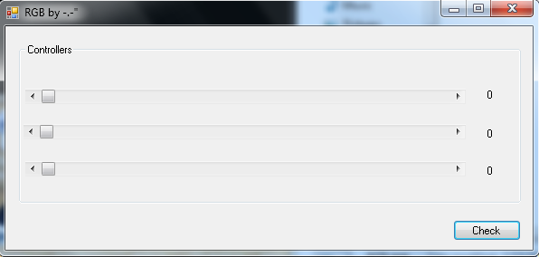
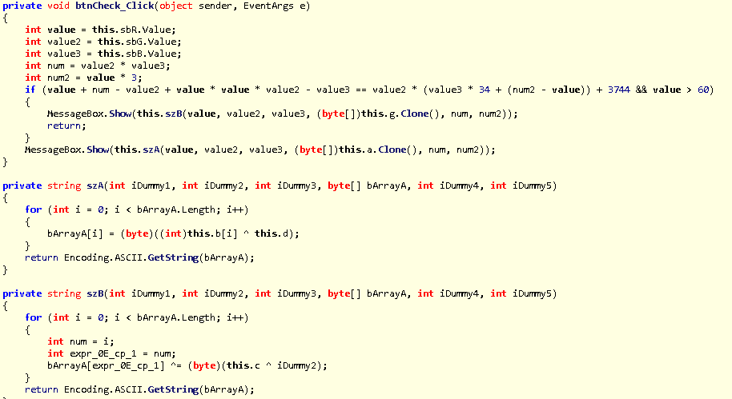
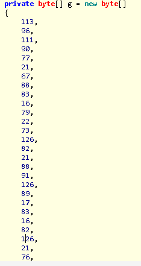
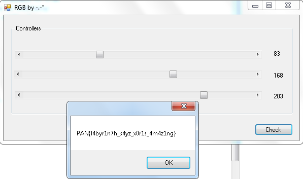

# PAN LabyREnth CTF 2016: Windows Level 5 - RGB

## Write-up

This challenge is a Windows GUI program written in .NET. I used ILSpy to check out the program logic.
Running the program, it allows you to move three slider bars between the values of 0-255.

### Solution
Using ILSpy, you can see the code responsible for the value validation.

In the btnCheck_Click method, I need to get the if statement to evaluate to true
inorder to output the flag. Perfect chance to use Z3. Setting up z3 initially 
told me that the problem was unsatisfiable. Looking at the code again, I
see that I can easily simplify the problem by hand.

If you look at what the method calls for successful values,
a MessageBox is called using the output of the method szB.
szB uses the g array.

Using this and the knowledge of the first character of the flag.
We can figure out the value of value2.

Solving the equation:
> 113 xor 137 xor 80

This gives me a value2 of 168.

Now trying my z3 python script I get the solution.

value = sbR = 83, value2 = sbG = 168, value3 = sbB = 203

#### Flag
> PAN{l4byr1n7h_s4yz_x0r1s_4m4z1ng}
