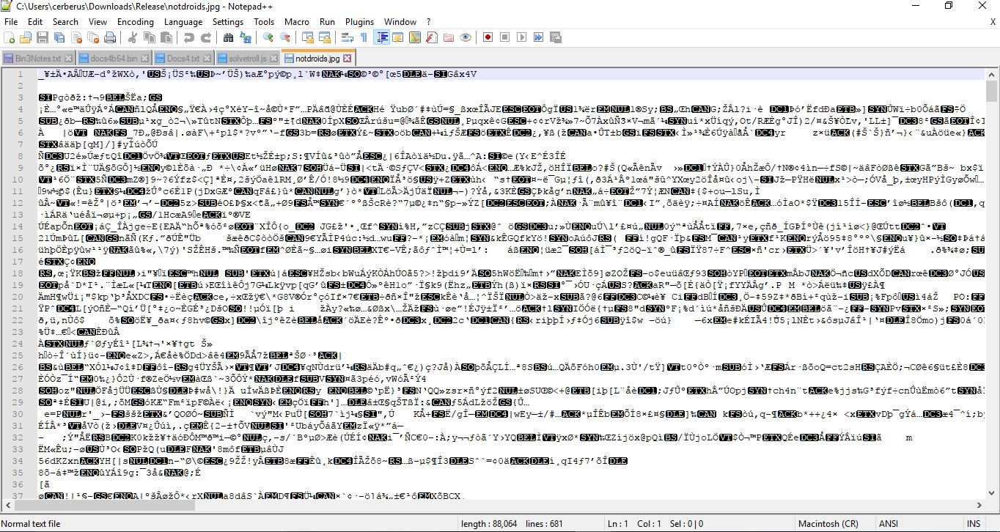
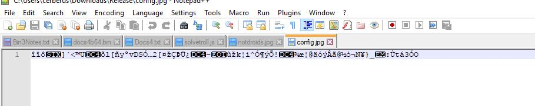
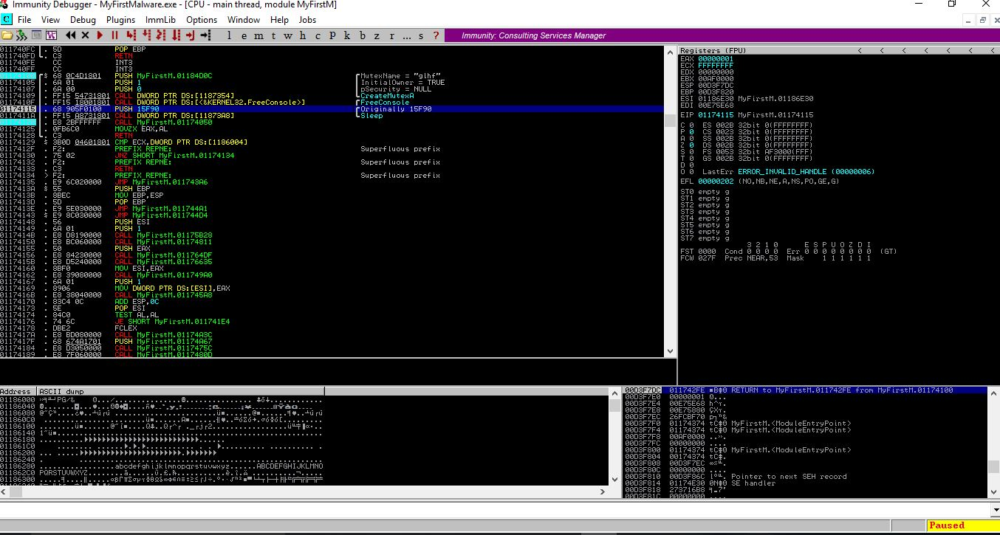
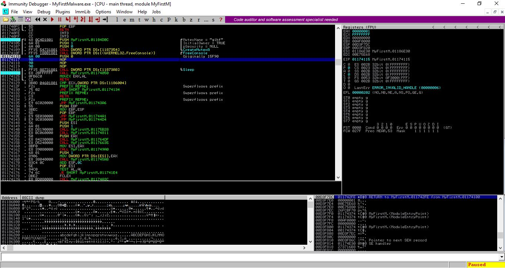
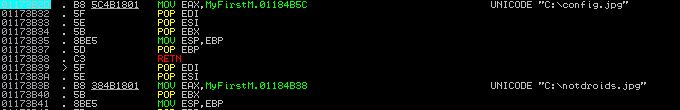
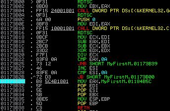
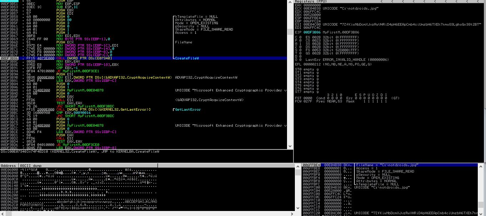
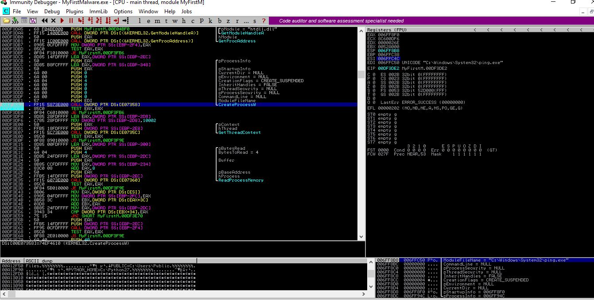
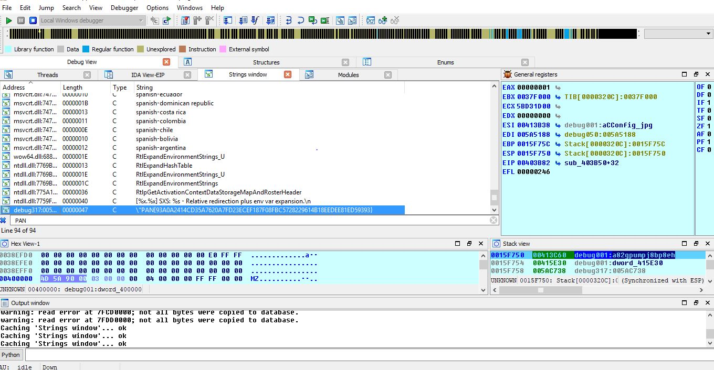

# PAN LabyREnth 2017: Binary Level 1 - BBzFirstMalware

BBz First Malware make u cry evry time

## Write-up
We're given a 32-bit PE binary named MyFirstMalware.exe and other files named config.jpg and notdroids.jpg. The JPG files are not JPG file but are some sort of encrypted data.

Initially running the binary doesn't give any output.

### Solution
Now time to debug/reverse it. I used Immunity Debugger, IDA Pro, procmon for this purpose. Right after the entry point it creates a mutex named "glhf" after which it sets a call to sleep with a very high value. I patched what is pushed to the sleep function to 0.

Continuing on, there are some hints as to where the binary expects the JPG files.

I place those files there and restart the debugging.

I then run into some anti-debugging technique using the rdtsc call which I use the hidedebug plugin to overcome.

The binary then opens the notdroids.jpg file for reading.

Then it sets up the crypto routine for decrypting the file contents.

Then the binary creates a new suspended process C:\Windows\system32\ping.exe which will begin to hollow that process to inject other code provided by the decrypted contents of the notdroid.jpg file.

Once the code is injected the process is resumed, must be attached with a debugger before then or you'll miss it.

After a little stepping in IDA, we can see it opens and decrypts the contents of the config.jpg file and then gives us our flag.

#### Flag
> PAN{93A0A2414CD35A7620A7FD23ECEF187F08FBC5728229614B18EEDEE81ED59393}

