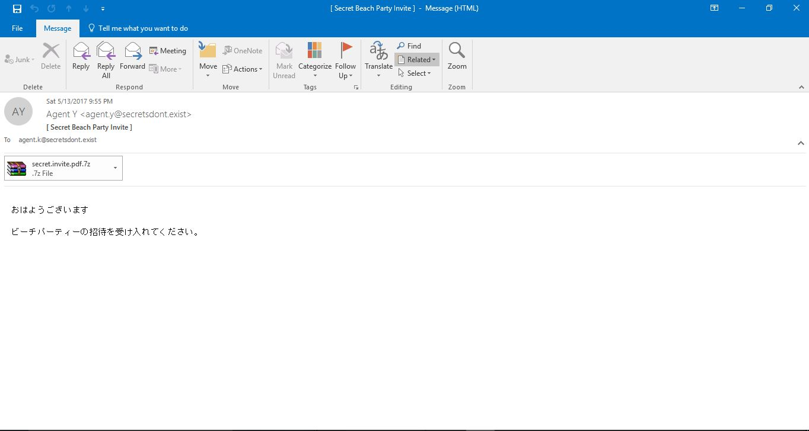

# PAN LabyREnth 2017 - Docs #3

Hint: A zip, a js, a binary, oh my! I heard you like layerz dawg, so
I put more layers inside yo' layers.

## Write-up
We're given a file called Secret Beach Party Invite.msg
Secret Beach Party Invite.msg contains a password protected 7z archive.

Writen in a white color: http://www.reversing.sg/B3@chP@r7y/

In the source of the web page, we have Bender.

>R3JlYXQgc3RhcnQgaW4gZmluZGluZyB0aGlzIGNsdWUuICANCldlIGhvcGUgdGhhdCB5b3UgbGlrZSBodW50aW5nLiANCkFzIHRoZXJlIGFyZSBzZXZlcmFsIHRoaW5ncyBmb3IgeW91IHRvIGh1bnQgZm9yLg0KDQpUaGUgaGludCB0byBsb2dpbiBpczogDQpvbWd3dGZub2JicQ==

Decoding the base64 string gives us this.

Great start in finding this clue.  
We hope that you like hunting. 
As there are several things for you to hunt for.

The hint to login is: 
omgwtfnobbq

At benders chest is a hexencoded string.
>676f6f2e676c2f795632744673
Which decodes to goo.gl/yV2tFs and takes us to http://www.reversing.sg/B3@chP@r7y/Part1.png
This is the first part of our flag.

omgwtfnobbq is the password to the archive in the msg file.
contains a pdf file

pdf contains an HWP file

HWP file drops troll.js in %appdata%

lX0vbnD variable contains function calls that reveal http://reversing.sg/pdfHWP/part1.flag.exe

part1.flag.exe in a 32 .NET GUI app

We are given some hints in from the binary.

usb resource in rickroll.resx contains a pcap file.
that pcap contains 5 images which one has to be xored with 0x21

The last bit of data needs to be xored with 0x21 inorder to reveal a png file

the png file has half of the flag

#### Flag

>PAN{N0thing_l5_S@f3_ln_Thi5_W0rld!}
