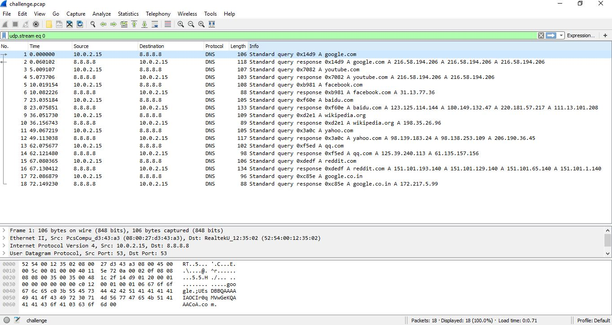
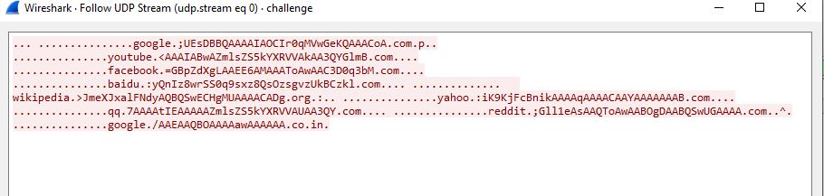
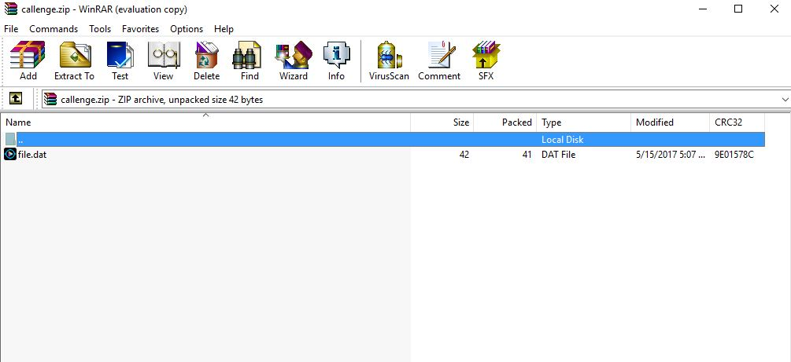
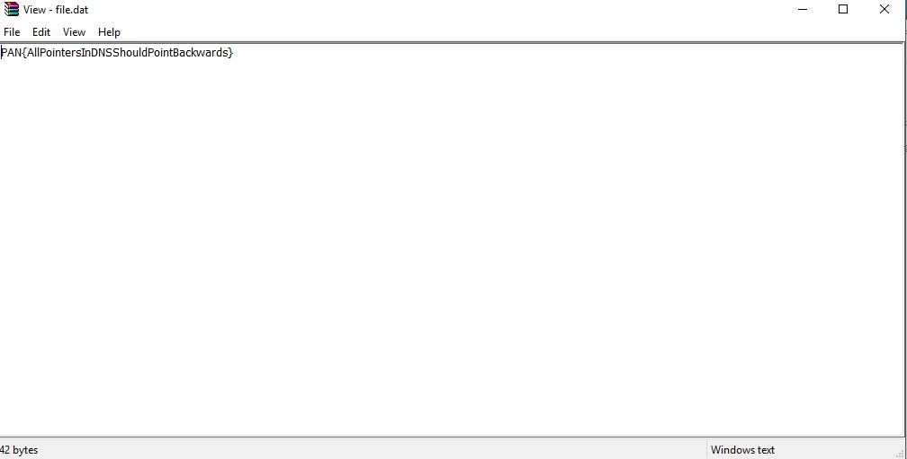

#PAN LabyREnth 2017 - Threat #1

Hint: Just because it's protocol compliant doesn't mean it's a good idea.

## Write-up
We're given a packet capture called challenge.pcap with a few DNS queries.

### Solution

Taking a look at the packet capture in Wireshark you can see a few DNS query and query responses. If you follow the UDP stream for just the queries, you can find some base64 encoded data appended to the query. Put together and decoded, you are left with a zip archive.

Inside the archive is the file file.dat which contains the flag.

#### Flag
> PAN{AllPointersInDNSShouldPointBackwards}
 

